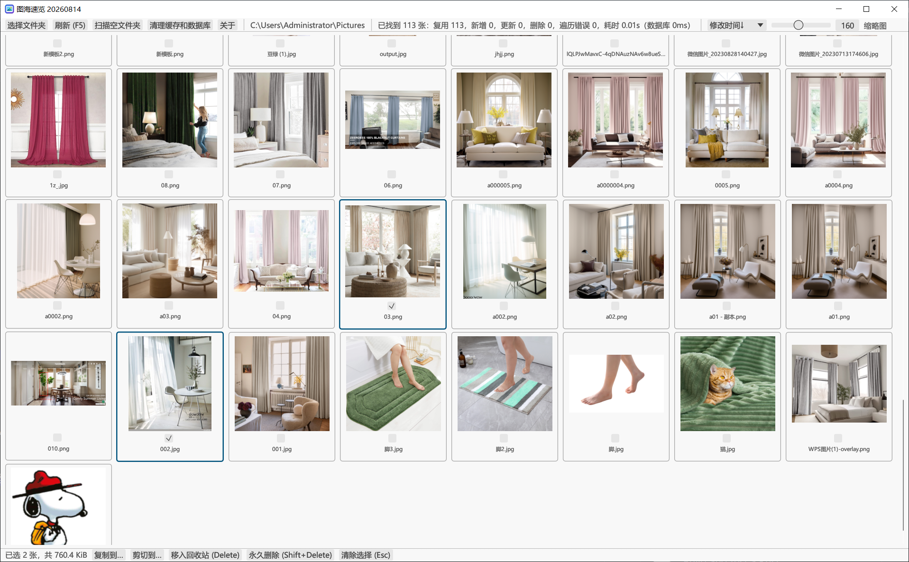

# 图海速览

Windows 10/11 x64 上运行的高性能图片浏览与整理工具，面向包含上万张图片的文件夹。



- 微信公众号：大王没有玉玺
- 版本号：20260906
- 当前开发交付：20260906 本地修复版，包含文件名搜索、界面打磨及扫描顺序稳定修复；见 [修复与验证记录](performance-results/20260906/SCAN-ORDER.md)。完整性能验收尚未完成，历史性能对照见 [实测报告](PERFORMANCE.md)。

## 关注与赞赏

| 微信公众号：大王没有玉玺 | 微信赞赏码 |
|:---:|:---:|
|  |  |

## 当前功能

- 递归扫描 JPG/JPEG、PNG、WebP、GIF、BMP、TIFF、ICO；跳过符号链接。
- SQLite 缓存图片索引，扫描结果分批进入界面。
- 扫描期间新图片追加到末尾，避免已显示图片反复换位；扫描完成后按所选方式统一排序。主动搜索或切换排序立即生效。
- 文件名搜索：输入片段后自动筛选，支持中文、英文忽略大小写和扩展名匹配；`Ctrl+F` 聚焦，回车立即搜索，清空恢复列表。
- 虚拟化缩略图网格，预览专用线程、SSD 4 / HDD 2 个普通解码线程，以及按字节计量的资源预算。
- Ctrl/Shift 多选、Ctrl+A 全选、Esc 清除、Delete 回收站、Shift+Delete 永久删除。
- 内置大图预览，使用中性浅灰画布及与主界面一致的工具栏：上一张/下一张、滚轮缩放、适应窗口、预览 100%、旋转、拖拽滚动。
- 复制/剪切到应用内选择的目标文件夹；支持覆盖、跳过、自动重命名。
- 右键在资源管理器中定位或使用系统默认程序打开。
- 扫描并复核真正为空的子文件夹后移入回收站或永久删除。
- 使用文件大小与 SHA-256 查找内容完全相同的图片，可每组保留一张、删除整个重复组，或在主界面隐藏多余副本而不删除文件。
- 按路径合并目录变化，局部校验；F5 执行完整校验。

## 文件名搜索

在工具栏第二行输入文件名的一部分，可搜索当前目录及子目录中已收录的图片。关键词首尾空白会被忽略，中间空格按原文匹配；不搜索文件夹路径，不支持通配符或正则表达式。

输入停止 150 ms 后自动筛选，中文输入法确认文字后才开始计时。扫描期间结果持续更新；刷新保留关键词，打开其他目录或重启应用清空关键词。开启“重复副本只显示一张”时，隐藏副本不会出现在搜索结果中，需要时可关闭去重后重试。

扫描期间，后续批次中新匹配的图片追加到当前结果末尾；工具栏显示“扫描中，完成后统一排序”。扫描完成后会按所选方式统一排序一次，因此结束时顺序仍可能调整。主动修改搜索条件或切换排序会立即重新排列当前结果；删除、重命名导致不再匹配的图片会正常移出结果。

搜索框内 `Ctrl+A` 和 Delete 只编辑文字；Esc 先清空文字，再次按下退出焦点。搜索框之外的 `Ctrl+A` 只选择当前结果。筛选期间暂时禁用图片选择和文件操作，结果生效后取消对不可见图片的选择；清空搜索不会恢复这些选择。大图预览只在当前筛选结果中翻页。

工具栏保留全部直接入口，窄窗口自动换行。任务状态和扫描进度完整显示，空间不足时换行。过长的目录会省略显示，悬停可查看完整内容；图片文件名同样支持悬停查看名称及完整路径。选中图片通过勾选、强调色边框和浅底色共同标识。

打开其他工具栏菜单时，之前的辅助窗口及未确认弹窗自动关闭；后台任务继续执行，完成后不会抢回已切换的界面。欢迎页内容整体略高于中央，便于视觉浏览。

## 构建

需要 Rust MSVC 工具链、Windows SDK、CMake、Ninja 和 NASM（必须启用 JPEG SIMD）。依赖已锁定，libjpeg-turbo 与 C 运行库静态链接：

```powershell
rustup default stable-x86_64-pc-windows-msvc
# 中文工作区建议使用 ASCII 构建输出目录
$env:CARGO_TARGET_DIR='G:\tuhai-build'
cargo run --release --locked
```

上述命令的发布文件位于 `G:\tuhai-build\release\TuHaiView.exe`；未设置输出目录时为 `target\release\TuHaiView.exe`。程序不需要管理员权限。

## 开发文档

项目结构、性能设计、缓存位置、版本更新和发布流程参见 [DEVELOPMENT.md](DEVELOPMENT.md)。

## 性能与数据

预览先显示已有缩略图，再按窗口像素加载 1024 / 2048 / 4096 档；最高最长边 4096，小图不放大解码。“预览 100%”对应预览像素，界面同时标明源图和预览分辨率。

缩略图磁盘缓存默认 1 GiB，可选 1 / 2 / 4 / 8 / 16 GiB。JPEG 来源使用质量 85 的 JPEG，其他图片使用无损 WebP。旧 RGBA 缓存命中后后台迁移。数据仍保存在 EXE 同目录的 `data` 中。

实现说明、实测结果及尚未通过的验收项目见 [PERFORMANCE.md](PERFORMANCE.md)。预算约束应用管理的缓冲区，不能视为进程总内存硬上限。

## 开源协议

本项目采用 [MIT License](LICENSE)，版权署名为 `Copyright (c) 2026 XMQSVIP`。第三方依赖和 vendored 代码保留各自的许可证与版权声明。
